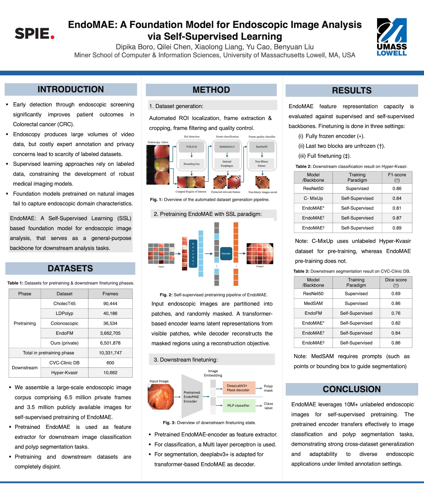

# EndoMAE: A Foundation Model for Endoscopic Image Analysis via Self-Supervised Learning

Published in *Medical Imaging 2026: Computer-Aided Diagnosis (Proc. SPIE 13926)*, April 2026

## Abstract
Large vision models (LVMs) pretrained on massive visual datasets have demonstrated strong transferability across downstream tasks such as classification, detection, and segmentation. This transferability makes them particularly effective in low-labeled data settings where representation learning from unlabeled data has emerged as a promising alternative to fully supervised approaches. In this work, we introduce EndoMAE, a self-supervised foundation model for endoscopic image analysis based on masked autoencoding. For pretraining, we curate a large-scale, high-quality dataset by automatically filtering and processing raw endoscopic video frames to retain only anatomically relevant regions and remove low-quality samples. This process yields 6.5 million endoscopic images, which are combined with publicly available data to form a corpus of over 10 million images for self-supervised pretraining. EndoMAE is trained to reconstruct masked image patches, encouraging the learning of rich, domain-specific representations without manual annotations or prompt engineering. We evaluate EndoMAE on endoscopic benchmarks that are fully disjoint from the pretraining datasets for image classification and polyp segmentation as downstream tasks. We compare EndoMAE with both supervised and self-supervised pretrained feature extractors. Compared to self-supervised baselines, EndoMAE achieves gains of up to 5.2\% F1 and 10.2\% dice score across the respective tasks, demonstrating strong cross-dataset generalization and task adaptability in low-annotation endoscopic imaging settings.

## Paper
 
- [📄 SPIE page](https://www.spiedigitallibrary.org/conference-proceedings-of-spie/13926/139262H/EndoMAE--a-foundation-model-for-endoscopic-image-analysis-via/10.1117/12.3087375.short)

- [🔗 DOI](https://doi.org/10.1117/12.3087375)

## Poster
[Download the poster (PDF)](poster/poster.pdf)

<p align="center">
  
</p>

## Citation

If you find this work useful, please cite:

```bibtex
@inproceedings{boro2026endomae,
  author = {Dipika Boro and Qilei Chen and Xiaolong Liang and Yu Cao and Benyuan Liu},
  title = {EndoMAE: a foundation model for endoscopic image analysis via self-supervised learning},
  booktitle = {Medical Imaging 2026: Computer-Aided Diagnosis},
  series = {Proc. SPIE 13926},
  pages = {139262H},
  year = {2026},
  doi = {10.1117/12.3087375}
}

